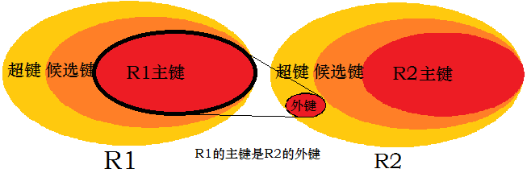
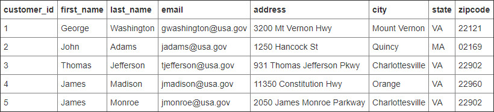
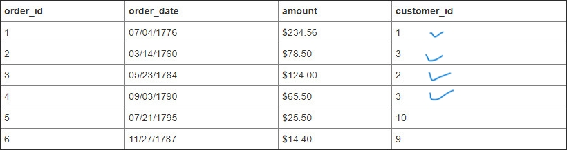
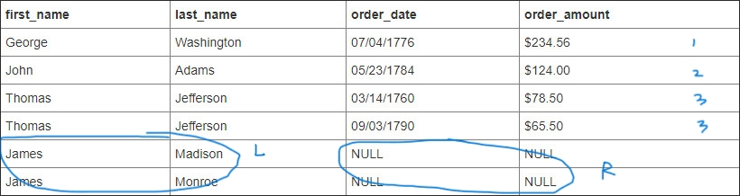
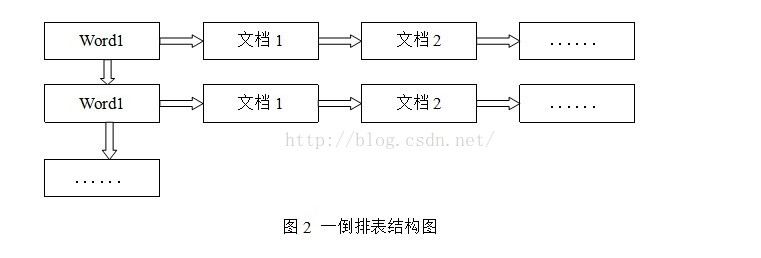

- [据库三大范式是什么](#据库三大范式是什么)
- [*键*：超键、候选键、主键、外键（关系模型中）](#键超键候选键主键外键关系模型中)
  - [内连接](#内连接)
  - [外连接](#外连接)
- [MySQL 存储引擎](#mysql-存储引擎)
  - [MyISAM 存储引擎](#myisam-存储引擎)
    - [MyISAM 存储格式](#myisam-存储格式)
  - [InnoDB](#innodb)
    - [InnoDB 的事务隔离级别](#innodb-的事务隔离级别)
  - [Memory](#memory)
  - [MyISAM 与 InnoDB 区别 **](#myisam-与-innodb-区别-)
- [MySQL 锁](#mysql-锁)
- [索引](#索引)
  - [索引类型](#索引类型)
  - [聚簇索引](#聚簇索引)
  - [最左前缀原则；最左匹配原则](#最左前缀原则最左匹配原则)
- [其他](#其他)
  - [Mysql 权限表](#mysql-权限表)
  - [Binlog的录入格式](#binlog的录入格式)
  - [存储货币等精确值](#存储货币等精确值)
  - [使用索引查询一定能提高查询的性能吗？](#使用索引查询一定能提高查询的性能吗)
  - [删除百万级别数据](#删除百万级别数据)
  - [临时表](#临时表)
- [SQL 优化](#sql-优化)


## 据库三大范式是什么

1. 第一范式：每一列属性都是不可再分的属性值，确保每一列的**原子性**
2. 第二范式：在第一范式的基础上，非主键列完全依赖于主键。数据库表中的每个实例或行必须可以被惟一地区分。为实现区分通常需要为表加上一个列，以存储各个实例的惟一标识。这个惟一属性列被称为**主键**
3. 第三范式：在第二范式的基础上，非主键列只依赖于主键，不依赖于其他非主键。数据不能存在传递关系，即**每个属性都跟主键有直接关系**而不是间接关系。像：a-->b-->c  属性之间含有这样的关系，是不符合第三范式的。

比如Student表（学号，姓名，年龄，性别，所在院校，院校地址，院校电话）

这样一个表结构，就存在上述关系。 学号--> 所在院校 --> (院校地址，院校电话)

这样的表结构，我们应该拆开来，如下。
（学号，姓名，年龄，性别，所在院校）--（所在院校，院校地址，院校电话）


```三大范式只是一般设计数据库的基本理念，可以建立冗余较小、结构合理的数据库。如果有特殊情况，当然要特殊对待，数据库设计最重要的是看需求跟性能，需求>性能>表结构。所以不能一味的去追求范式建立数据库。```

## *键*：超键、候选键、主键、外键（关系模型中）
- 超键（SK）：能唯一标识元组的属性集
- 候选键：能唯一标识元组 并且 不含多余属性 的属性集
- 主键（PK）：若干个候选键中随意指定一个作关键字，该关键字为PK
- 外键（FK）：关系模型$R_1$中的某属性不是$R_1$候选键，而是$R_2$中的候选键，则该属性集是$R_1$的外键
  


### 内连接
结合两个表中相同的字段，返回关联字段相符的记录就是内链接。


### 外连接
外连接分为三种，分别是是左外连接(LEFT OUTER J0IN 或 LEFT JOIN），右外连接(RIGHT JOIN），全外连接(FULL JOIN)。

左外连接:又称为左连接，这种连接方式会带上**左表不符合条件的数据行**，其中，右表不符合条件的数据直接显示 NULL。
`左外连接 = 内连接 + 左边表中失配的元组`。

>考虑
>  
> 
```SQL
select first_name, last_name, order_date, order_amount
from customers c
left join orders o
on c.customer_id = o.customer_id
```
> 结果
> 


右外连接则反之。
  


## MySQL 存储引擎
### MyISAM 存储引擎
是早期默认引擎，
- **不支持 事务 和 外键**，所以访问速度比较**快**。
如果应用主要以读取和写入为主，只有少量的更新和删除操作，并且对事务的完整性、并发性要求不是很高，那么选择 MyISAM 存储引擎是非常适合的。

- MyISAM 默认的锁粒度是**表级锁**，所以并发性能比较差，加锁比较快，锁冲突比较少，不易发生死锁
- 支持的索引类型有全局索引(Full-Text)、B-Tree 索引、R-Tree 索引
  - 全局索引的出现是为了解决针对文本的模糊查询效率较低
  - B-Tree 索引：的索引节点都按照平衡树的数据结构来存储，所有的索引数据节点都在叶节点
  - R-TREE 的优势在于范围查找。


 
MyISAM 是在 Web 数据仓储和其他应用环境下最常使用的存储引擎之一。

#### MyISAM 存储格式
每个 MyISAM 表格以三种格式存储在磁盘上：
- “.frm”文件 存储表定义
- 数据文件具有“.MYD”（MYData）扩展名
- 索引文件具有“.MYI”（MYIndex）扩展名 *（tips：MyISAM 只缓存索引文件，不缓存数据文件。）*

### InnoDB
默认的事务型引擎。具有事务 ACID 隔离特性，默认的隔离级别是可重复读(repetable-read)、通过 MVCC(并发版本控制)来实现的。能够解决 脏读和 不可重复读 的问题。

InnoDB 存储引擎在事务上具有优势，有安全的日志文件，即支持具有提交、回滚和崩溃恢复能力的事务安装，所以比 MyISAM 存储引擎**占用更多的磁盘空间**。

如果应用对**事务的完整性**有比较高的要求，在并发条件下要求**数据的一致性**，数据操作除了插入和查询以外，还包括很多的更新、删除操作，那么 InnoDB 存储引擎是比较合适的选择。
 
InnoDB 存储引擎除了可以有效地降低由于删除和更新导致的锁定，还可以确保事务的完整提交（Commit）和回滚（Rollback）。
对于类似计费系统或者`财务系统`等对数据准确性要求比较高的系统，InnoDB 都是合适的选择。
> 事务（Transaction）：事务是一组SQL语句，要么全部执行成功，要么全部执行失败（原子的）。用于处理操作量大，复杂度高的数据。事务是必须满足4个条件（ACID）：原子性（Atomicity）、一致性（Consistency）、隔离性（Isolation）、持久性（Durability）。
#### InnoDB 的事务隔离级别
1. read uncommited：读到未提交数据
2. read committed：脏读，不可重复读
3. repeatable read：可重读
4. serializable：串行事物

### Memory
MEMORY 存储引擎将所有数据保存在 RAM 中，所以该存储引擎的数据访问速度快，但是安全上没有保障。
MEMORY 对表的大小有限制，太大的表无法缓存在内存中。由于使用 MEMORY 存储引擎没有安全保障，所以要确保数据库异常终止后表中的数据可以恢复。
 
如果应用中涉及**数据比较少**，且需要进行**快速访问**，则适合使用 MEMORY 存储引擎。

### MyISAM 与 InnoDB 区别 **
- 锁粒度不同，InnoDB 比 MyISAM 支持更高的并发。InnoDB 的锁粒度为行锁，开销大，但是能解决脏读和不可重复读的问题，相对来说也更容易发生死锁。
MyISAM 的锁粒度为表锁。

- InnoDB 是有事务日志的，崩溃等条件后，可以根据日志文件进行恢复
- 查询性能上:MylSAM 要优于 InnoDB。因为 InnoDB 在查询过程中，是需要维护数据缓存。
- 表结构差异：MyISAM 的表结构文件包括:frm(表结构定义),MYI(索引),MYD(数据);
  而 InnoDB 的表数据文件为:ibd 和 frm(表结构定义)。
- InnoDB 的表数据与索引数据是存储在一起的，都位于 B+数的叶子节点上，而 MylSAM 的表数据和索引数据是分开的。
 


## MySQL 锁
- **表**级锁：开销小，加锁快；不会死锁；锁定粒度大，发生锁冲突的概
率最高，并发度最低。
- **行**级锁：开销大，加锁慢；会死锁；锁定粒度最小，发生锁冲突的概
率最低，并发度也最高。
- **页面**锁：开销和加锁时间界于表锁和行锁之间；**会出现死锁**；锁定粒度界
于表锁和行锁之间，并发度一般。

## 索引
### 索引类型
- **主键**索引（PK）: 数据列不允许重复，不能为 NULL，一个表只能有一个主键。
- 唯一索引：数据列不允许重复，允许为 NULL 值，一个表允许多个列创建唯一索引。（往往用来避免数据重复）

```SQL
ALTER TABLE table_name ADD UNIQUE (column1,column2); 
```

- 普通索引：无唯一性限制，允许为 NULL 值。 `ADD INDEX`
- 全文索引：基于倒排索引技术（Inverted index）。
    - 倒排表
  
倒排表以字或词为关键字进行索引，表中关键字所对应的记录表项记录了出现这个字或词的所有文档，一个表项就是一个字表段，它记录该文档的ID和字符在该文档中出现的位置情况。



```SQL
ALTER TABLE table_name ADD FULLTEXT (column);
-- 查询
select * from table_name where match(##,##) against(''xxxx)
```

### 聚簇索引
- 聚簇索引：将数据存储与索引放到了一块，找到索引也就找到了数据。
- 非聚簇索引：将数据存储于索引分开结构，索引结构的叶子节点指向了数据的对应行。
>MyISAM 通过 key_buffer 把索引先缓存到内存中，当需要访问数据时（通过索引），在内存中直接搜索索引，然后找到磁盘相应数据.

### 最左前缀原则；最左匹配原则
索引的底层是B+树。
- *最左前缀原则*：顾名思义是最左优先，以最左边的为起点任何连续的索引都能匹配上。根据业务需求，where 子句中使用最频繁的一列放在最左边。
>当创建(a,b,c)复合索引时，想要索引生效的话,只能使用 a和a,b和a,b,c三种组合.

- *最左前缀匹配原则*，MySQL 会一直向右匹配直到遇到范围查询(>、<、between、like)就停止匹配，比如 a = 1 and b = 2 and c > 3 and d = 4 如果建立(a,b,c,d)顺序的索引，d 是用不到索引的。如果建立(a,b,d,c)的索引则都可以用到，a,b,d 的顺序可以任意调整。= 和 in 可以乱序，比如 a = 1 and b = 2 and c = 3 建立(a,b,c)索引可以任意顺序，MySQL 的查询优化器会帮你优化成索引可以识别的形式


## 其他
### Mysql 权限表
- user 权限表：记录允许连接到服务器的用户帐号信息，里面的权限是全局
级的。
- db 权限表：记录各个帐号在各个数据库上的操作权限。
- table_priv, columns_priv权限表：记录数据表级和列级的操作权限。
- host 权限表：配合 db 权限表对给定主机上数据库级操作权限作更细致的控制。这个权限表不受 GRANT 和 REVOKE 语句的影响。

### Binlog的录入格式
binlog是记录所有数据库表结构变更（例如CREATE、ALTER TABLE…）以及表数据修改（INSERT、UPDATE、DELETE…）的二进制日志。

1. **row** 级别下，不记录 SQL 语句上下文相关信息，仅保存哪条记录被修改。记录单元为**每一行的改动**，基本是可以全部记下来但是由于很多操作，会导致大量行的改动(比如 alter table)，因此这种模式的文件保存的信息太多，日志量太大。

2. **statement** 模式下，每一条会修改数据的 **SQL** 都会记录在 Binlog 中。不需要记录每一行的变化，减少了 Binlog 日志量，节约了 IO，提高性能。由于sql 的执行是有上下文的，因此在保存的时候需要保存相关的信息，同时还有一些使用了函数之类的语句无法被记录复制。

3. **mixed**，一种折中的方案，普通操作使用 statement 记录，当无法使用
statement 的时候使用 row。

### 存储货币等精确值
`NUMERIC` 和 `DECIMAL` 类型被 MySQL 实现为同样的类型。
对值的规模和精度可以自指定，如：`salary DECIMAL(9,2)`。
其中precision代表将被用于存储值的总的位数，而scale代表将被用于存储小数点后的位数。0 <= s <= p <= 38。所以-9999999.99 < salary < 9999999.99。

### 使用索引查询一定能提高查询的性能吗？
一般来说，通过索引查询数据比全表扫描要快。但其代价是需要额外存储空间，且在`INSERT`，`DELETE`，`UPDATE`之后需要修改维护索引。索引范围查询(`INDEX RANGE SCAN`)适用于两种情况:
- 基于一个范围的检索，一般查询返回结果集小于表中记录数的 30%
- 基于非唯一性索引的检索

### 删除百万级别数据
1. Detele 表名 where 条件。慢且生成大量日志
2. TRUNCATE TABLE 表名 。快，删除全表，无法添加where条件语句
3. 已知删除数据的速度和创建的索引数量是成正比的。所以可以：
   1. 先删除索引
   2. 删除其中无用数据
   3. 重新创建索引（数据较少，创建快）

### 临时表
MySQL 在执行 SQL 语句的过程中，通常会临时创建一些存储中间结果集的表，这些表名以#开头。临时表只对当前连接可见，在连接关闭时，临时表会被删除并释放所有表空间。
临时表分为两种：磁盘临时表采用的是 MylSAM 存储引擎，而内存临时表使用的是 MEMORY 存储引擎而。
如下情况会产生临时表：

- 使用 `UNION` 查询会产生临时表。（tips：用 UNION 会去掉两个表中的重复数据，即对结果集做了一下去重；使用 UNIONALL，则不返回全部。）
- `TEMPTABLE` 算法是一种创建临时表的算法，它是将结果放置到临时表中

## SQL 优化
- 对查询进行优化，要尽量避免全表扫描，首先应考虑在 where 及 order by 涉及的列上建立索引。
- 查询语句无论是使用哪种判断条件（<,=,>），WHERE 左侧的条件查询字段不要使用函数或者表达式

- 注意以下，否则将导致引擎放弃使用索引而进行全表扫描 
  1. 应尽量避免在 where 子句中对字段进行 null 值判断，
  2. 应尽量避免在 where 子句中使用 != 或 <> 操作符，
  3. 应尽量避免在 where 子句中使用 or 来连接条件，（如一个字段有索引，一个字段没有索引）
  4. in 和 not in 要慎用，否则会导致全表扫描。对于连续的数值，可用 between 代替。
  5. 注意最左前缀原则
  6. 使用 LIKE%abc% 不会走索引，而使用 LIKE abc%会走索引。

- 使用`EXPLAIN`命令分析、优化查询语句 