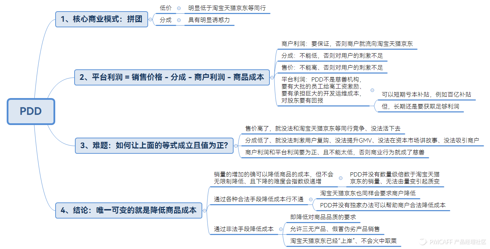
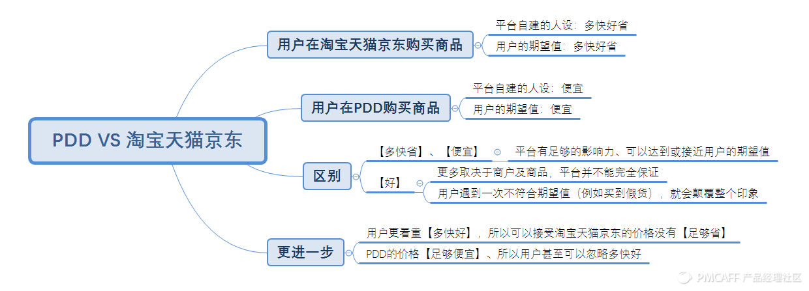
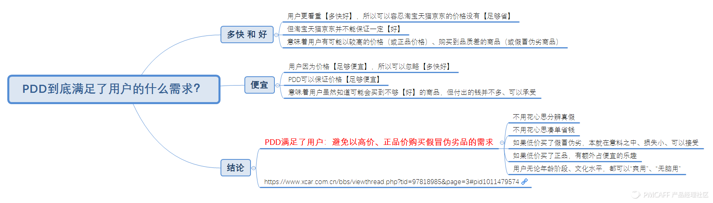

## PDD到底解决了用户的什么需求？
他们热爱打折、热爱便宜、时间充足，简言之就是时间不值钱，只要你便宜，我有的是时间。而且根据我国的收入结构图来看，大部分人都在这个群体中，这批人就是多多的基本盘，然后就是跟微信搞的苟且之事！对于电商来说，本质是流量和变现，这时多多伙同微信流量开始大肆扩张.

群用户圈下来，如何留存呢？多多果园、多多牧场啥的都给你安排上了。这些游戏有几个共同的特点：
- 第一点：使劲给我肝！我不要你的钱，我就要你的时间，你下班没事了想去购物，但小镇哪里有那么大那么便宜的商场啊，我拼多多给你，你来逛，逛了给你送水果给你送优惠券，只要你来我就送。
- 第二点：赌。整个页面充满了随机性，「砍一刀有机会获得」「分享有机会获得」，大家都认为自己是会获得的那个人，最主要也不要钱，赔点人情就行了，发展到后来市面上很多多多互砍群，大家连人情都不用赔了，最多赔点时间。
- 第三点：沉默成本巨大！上来点几下就给你把红包进度弄到99%，你弄还是不弄？
- 第四点：冲动消费！不给你购物车，不让你看到总计X件，你买一件享受一次下单乐趣，你其它平台删删减减还只能体验一次下单乐趣。

拼多多不是面向下沉市场，而是面对所有人群的**下沉需求**，这个需求就是就是低价。现在多少人在确定需要购买东西后会先自问「先去拼多多看看多少钱」，这句话多恐怖啊，你售后再牛，你东西再全，也是捡我多多剩下的。
