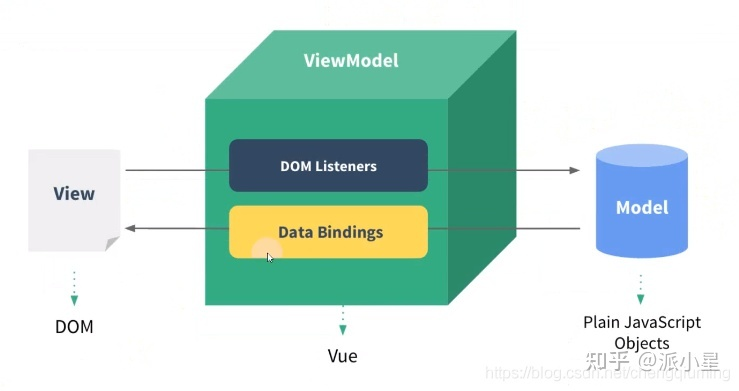
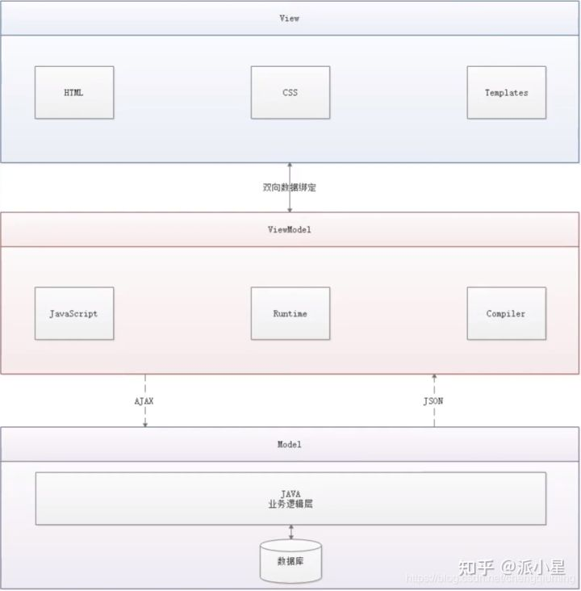

# MVVM
[c.f. 知乎](https://zhuanlan.zhihu.com/p/439724486)

#

- View是视图层，也就是用户界面。前端主要由HTML和CSS来构成，为了更方便地展现ViewModel或者Model层的数据。
  
- Model是指**数据模型**，泛指后端进行的各种业务逻辑处理和数据操控，主要围绕数据库系统展开。这里的难点主要在于需要和前端约定统一的接口规则。
  
- ViewModel 由前端开发人员组织生成和维护的视图数据层。在这一层，前端开发者从后端获取得到Model数据进行转换出来，做二次封装，以生成符合View层使用预期的视图数据模型。视图状态和行为都封装在ViewModel里。这样的封装使得ViewModel可以完整地去描述View层s。**数据驱动的** ！！！
> - ViewModel能够观察到数据的变化，并对视图对应的内容进行更新。
> - ViewModel能够监听到视图的变化，并能够通知数据发生变化。

MVVM源自于经典的MVC（Model-View-Controller）模式。
但其一个明显缺点是，MVC框架允许View和Model直接进行通信！
MVVM的核心是ViewModel层，负责转换Model中的数据对象来让数据变得更容易管理和使用，其作用如下：

该层向上与视图层进行双向数据绑定。
向下与Model层通过接口请求进行数据交互。

## 优点

- **低耦合**：视图（View）可以独立于Model变化和修改，一个ViewModel可以绑定到不同的View上，当View变化的时候Model可以不变，当Model变化的时候，View也可以不变。
- **可复用：** 可以把一些视图逻辑放到一个ViewModel里面，让很多View重用这段视图逻辑。
- **独立开发：** 开发人员可以专注于业务逻辑和数据的开发（ViewModel），设计人员可以专注于页面设计。
- **可测试：** 界面素来是比较难于测试的，而现在测试可以针对ViewModel来写
- MVVM架构将我们从命令式编程转移到了 **声明式编程**

### 实现案例
- Vue.js
- AngularJS
- 微信小程序

## 小程序 与 MVVM
> [c.f.](https://www.cnblogs.com/rope/p/10750322.html)
> [c.f.](https://blog.csdn.net/qq_26585943/article/details/54378684)

MINA(MINA IS NOT APP)就是微信小程序开发使用的框架。MINA的核心是一个响应的数据绑定系统。
整个系统分为两块：视图层(View) 和 逻辑层(App Service)。

通过{{}}实现数据的“强耦合”，所有的框架：Angular、React、Vue、ReactNative、小程序都是这样的“强耦合”的。还有setData()函数。

小程序=视图层+逻辑层+组件+API